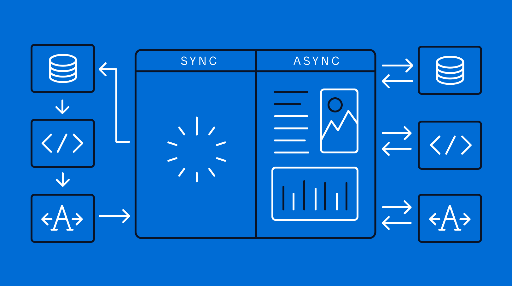

# HW12.\_Lection_about_API

# Lection 7 and 8 - Working with API

## What is an API?

An API, short for Application Programming Interface, is a software-to-software interface. APIs provide a secure and standardized way for applications to work together. They deliver the information or functionality requested without user intervention.

Because APIs do all the heavy lifting, digital experiences remain virtually effortless. That’s great news for end users (and third-party developers, but we’ll get to them in a minute).

## Real-World API Example

Say you want to see the latest box-office hit. Your first step might be searching where and when it’s playing on an online ticketing site like Fandango.

After typing in your zip code and selecting a date, you click “go.” Then, voilà, a list of showtimes at nearby theaters appears within seconds. Here’s what it looks like to the end user.

Although you stay on Fandango’s site the whole time, there are multiple applications at work to make your search possible. When you click “go,” the site uses APIs to request access to each theater’s database.

This is called an API call. Those APIs then retrieve the requested information so Fandango’s site displays the most relevant results for you.

As expectations for effortless user experiences grow, companies are turning to APIs that deliver more value in less time.

By leveraging APIs to access another company’s data, a piece of code, or services, you can extend the functionality of your own product while saving time and money. This can also help you stay agile in the marketplace.

## How do APIs work?

APIs are sets of definitions and protocols that allow software components to talk and interact with each other using a simple set of commands. Acting as messengers, APIs deliver one application’s request to another and return a response in real time.

If the server (the application providing the resource) can do what the client (the requesting application) asked, then the API will bring back the resource needed or a status code. This roughly translates into mission accomplished!

Sometimes the server can’t do what the client asks. Maybe the client requested a resource that doesn’t exist or that it doesn’t have permission to access. In this scenario, the API will return an error message.

Controlling access to the server in this way is crucial. Rather than give you all of a program’s information or code, an API provides you only with data made available to external users.

## API Calls

An API call is the process of a client application submitting a request to a server's API. An API call also comprises everything that happens after the request is submitted. This includes when the API retrieves information from the server and delivers it back to the client.

### Request Methods

Most clients want the server to carry out basic functions. These requests may be written as URLs. In this case, the communication between the client and server is dictated by <span style = "color:green;">Hyper-Text Transfer Protocol (HTTP)</span> rules. The four most basic request methods to a server are:

- GET: To retrieve a resource
- POST: To create a new resource
- PUT: To edit or update an existing resource
- DELETE: To delete a resource

Still confused? Let’s try an analogy. How APIs work is often compared to ordering food at a restaurant. Here, the diner represents the client. The waiter represents the API, and the chef represents the server.

You look over the menu, pick the meal you want, and place your order with the waiter. The waiter brings your request to the chef. The chef executes it. Then, the waiter brings you your meal. You enjoy it all the better for not having had to make it yourself.


But let’s say too many guests show up at the restaurant, and there’s not enough space to accommodate them. Let’s say this keeps happening as the restaurant grows in popularity. What then? That’s where API keys come in.

## What is an API key?

An API key is a unique identifier used to authenticate calls to an API. The key is made up of a string of letters and numbers that identify the client. (Remember, this is the application or site making the request.)

The key can grant or deny that request based on the client’s access permissions. The key also tracks the number of requests made for usage and billing purposes.

API keys are less secure than authentication tokens. However, this method has advantages over basic authentication, which only requires a username and password.

By restricting access only to those with keys, a company can control the number of calls made to its API. This ensures that only a specific, trusted group of clients can access its server’s resources.

Continuing our example above, think of an API key as a reservation and the API as an exclusive restaurant. By enforcing that patrons must have a reservation to eat at the restaurant, you can keep the number at capacity. The kitchen can adequately and efficiently serve every guest.

Similarly, by allowing only clients with an API key to access and use your resources, you help ensure your software is used safely. You can also guarantee that you can handle the number of incoming requests.

## What are APIs used for?

A better question might be what are APIs not used for? Want to embed Instagram photos on your e-commerce app? There’s an API for that. Want to provide instant access to thousands of hotels on your travel blog? There’s an API for that.

Generally speaking, business applications of APIs include:

- **Data sharing**. Any time a program needs to get data from a third party (e.g., a travel app compiling flight times from airlines), data can be shared through an API.

- **App integrations**. When two digital applications work in conjunction — HubSpot and Gmail, for example — an API is likely involved.

- **Embedded content**. To embed a piece of content that is hosted on a different website — like a YouTube video — a request is made to the embedded content's owner to retrieve it.

- **Internal systems**. APIs aren't only for sharing data externally. Businesses frequently divide their software infrastructure into smaller components. These elements communicate with each other through APIs, like in a microservice architecture.

These examples hit upon some of the most common reasons companies use APIs. Below, we dive into more examples of APIs and their business applications.

# Asynchronous vs. Synchronous Programming: Key Similarities and Differences



In computer programming, synchronous and asynchronous models are essential. The terms offer a clue about what each programming model does and the differences between them.

**Synchronous** tasks happen in order — you must finish task one before moving on to the next. **Asynchronous** tasks can be executed in any order or even simultaneously. But how can this be understood in terms of programming?

## What is the difference between asynchronous and synchronous programming?

Synchronous, sometimes referred to as “sync,” and asynchronous, also known as “async,” are two different types of programming models.

Understanding how these two models differ is critical in building application programming interfaces (APIs), creating event-based architectures, and deciding how to handle long-running tasks.

But before deciding which method to use and when, it’s important to know a few quick facts about synchronous programming and asynchronous programming.

## Synchronous programming

Synchronous is known as a blocking architecture and is ideal for programming reactive systems. As a single-thread model, it follows a strict set of sequences, which means that operations are performed one at a time, in perfect order.

While one operation is being performed, other operations’ instructions are blocked. The completion of the first task triggers the next, and so on.

To illustrate how synchronous programming works, think of a telephone conversation. While one person speaks, the other listens. When the first person finishes, the second tends to respond immediately.

## Asynchronous programming

Asynchronous programming is a multithreaded model that’s most applicable to networking and communications. Asynchronous is a non-blocking architecture, which means it doesn’t block further execution while one or more operations are in progress.

With asynchronous programming, multiple related operations can run concurrently without waiting for other tasks to complete. During asynchronous communication, parties receive and process messages when it’s convenient or possible rather than responding immediately upon receipt.

Texting is an asynchronous communication method. One person can send a text message, and the recipient can respond at their leisure. In the meantime, the sender may do other things while waiting for a response.

Another example of asynchronous programming is low-code app development. In a low-code platform, multiple developers can work on projects at the same time, which helps accelerate the process of delivering apps.

# Methods of asynchronous for getting array of objects from backend

There are two methods to get an array of object asynchronously using JavaScript, which can be used in JS and React

1. Using Promise with fetch API
2. Async await

1.Using Promise with fetch API:

```javascript
function getArray() {
  return new Promise((resolve, reject) => {
    const url = "https://exampleapiurl";
    // Make a request to server using Fetch api
    fetch(url)
      .then((response) => response.json())
      .then((data) => resolve(Object.values(data)))
      // Get values only as an Array object
      .catch(() => reject("Error in fetching data"));
  });
}
```

2. Async await syntax:

```js
async function getData() {
  try {
    let res = await fetch("http://localhost:3000/users");
    let data = await res.json();
    console.log(data);
  } catch (error) {
    console.log(error);
  }
}
```

Today people use the async awain syntax, because using promise is the old version of js. And also it's few difficult.

We can use async awain in two types:
1. Method fetch()
2. Library axios()
Both of this types can get the username, post the username, edit the username and delete the username

**Method fetch()**. The Fetch API provides a JavaScript interface for accessing and manipulating parts of the protocol, such as requests and responses. It also provides a global fetch() method that provides an easy, logical way to fetch resources asynchronously across the network.

Unlike XMLHttpRequest that is a callback-based API, Fetch is promise-based and provides a better alternative that can be easily used in service workers. Fetch also integrates advanced HTTP concepts such as CORS and other extensions to HTTP.

```js
async function logMovies() {
  const response = await fetch("http://example.com/movies.json");
  const movies = await response.json();
  console.log(movies);
}
```

2. Library axios()

We can use library axios from is its website, connect it to our project and use it. The library axios is so easy than fetch method.

